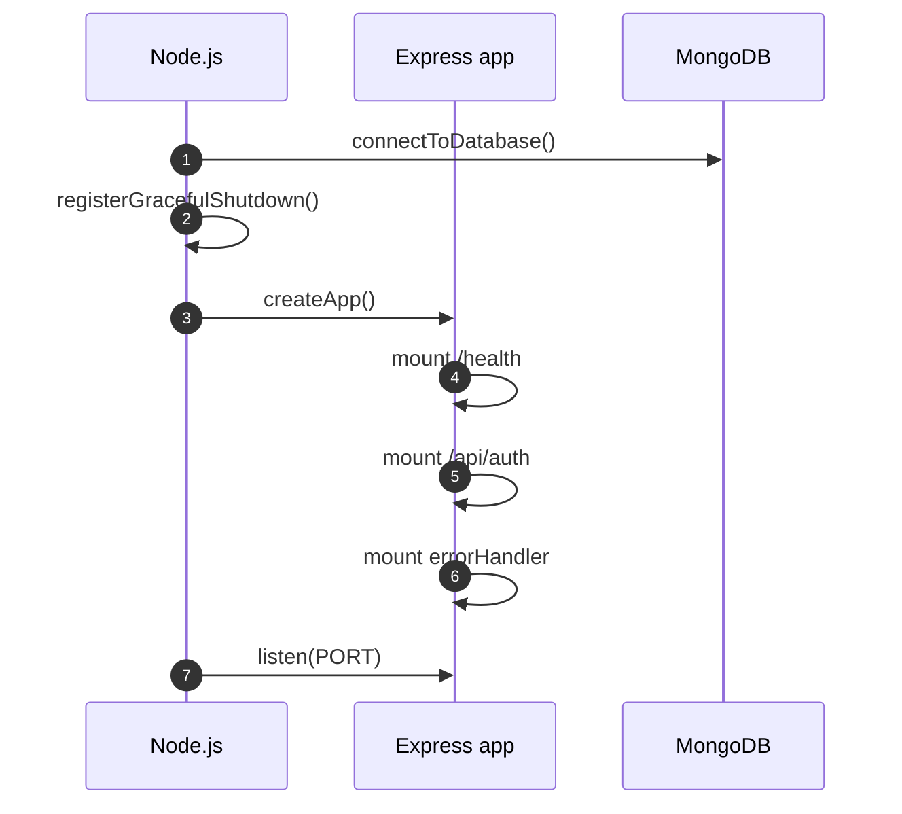
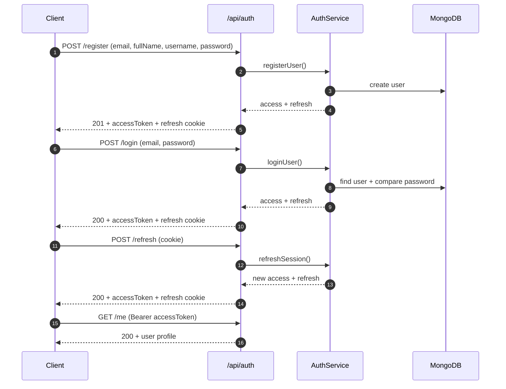

# Как устроен код ICHgram (объяснения поэтапно)

Документ описывает текущую структуру проекта, архитектурные решения, назначение ключевых файлов и причины выбранных подходов.
Важно: если пути или названия файлов меняются при рефакторинге, этот документ нужно обновлять.

## 1) Структура репозитория

- `/apps/client` — React + Vite + TypeScript (клиент).
- `/apps/server` — Express + TypeScript + MongoDB/Mongoose (сервер).
- `/docs` — документация: архитектура, API, безопасность, производительность, план.

Зачем так:

- Четкое разделение фронта и бэка.
- Упрощает сборку, CI и навигацию по коду.

## 2) Как запускается сервер

Файл: `apps/server/src/index.ts`

Что происходит:

1. Подключается MongoDB через `connectToDatabase()`.
2. Регистрируется graceful shutdown (`SIGINT`/`SIGTERM`).
3. Создается Express‑приложение `createApp()`.
4. Добавляется `/health` (проверка жизнеспособности).
5. Подключаются роуты `/api/auth`.
6. Подключается `errorHandler` в самом конце.
7. Запускается HTTP‑сервер.

Почему так:

- БД должна подключаться до обработки запросов.
- error handler должен быть последним, чтобы ловить все ошибки.

### Схема запуска сервера (Mermaid)



## 3) Конфигурация окружения

Файл: `apps/server/src/config/env.ts`

Что делает:

- Читает `.env` через `dotenv/config`.
- Валидирует переменные окружения через Zod.

Обязательные переменные:

- `PORT`
- `MONGO_URI`
- `JWT_ACCESS_SECRET`
- `JWT_REFRESH_SECRET`
- `CLIENT_ORIGIN`
- `ACCESS_TOKEN_TTL` (default 15m)
- `REFRESH_TOKEN_TTL` (default 7d)
- `NODE_ENV`

Почему так:

- Ошибки конфигурации видны сразу при старте.

## 4) Express app и middleware

Файл: `apps/server/src/app.ts`

Подключено:

- `helmet` — базовая безопасность заголовков.
- `express.json()` — парсинг JSON.
- `cookie-parser` — доступ к cookies.
- `cors` — CORS с `origin=CLIENT_ORIGIN` и `credentials=true`.
- `requestIdMiddleware` — добавляет `x-request-id` и `req.requestId`.

Почему так:

- CORS глобальный, иначе refresh cookie не будет работать в браузере.
- requestId упрощает трассировку ошибок.

## 5) Единый формат ошибок

Файлы:

- `apps/server/src/utils/errors.ts`
- `apps/server/src/middlewares/error-handler.ts`

Формат ответа:

```
{
  "error": {
    "code": "STRING_CODE",
    "message": "Human readable message",
    "details": { "field": "optional" },
    "requestId": "optional-id"
  }
}
```

Как работает:

- Любая Zod‑ошибка превращается в `VALIDATION_ERROR`.
- Если ошибка содержит `status`, она возвращается как API‑ошибка.
- Иначе — `INTERNAL_ERROR`.

Зачем:

- Единый контракт для клиента и предсказуемость обработки ошибок.

## 6) Request ID

Файл: `apps/server/src/middlewares/request-id.ts`

Что делает:

- Генерирует UUID на каждый запрос.
- Пишет в `req.requestId` и заголовок `x-request-id`.

Зачем:

- Удобнее отлаживать: можно связать клиентскую ошибку с серверными логами.

## 7) Валидация входящих данных

Файлы:

- `apps/server/src/middlewares/validate.ts`
- `apps/server/src/validations/auth.ts`

Как работает:

- `validate({ body/query/params })` парсит вход.
- При ошибке бросается `ZodError`, а `errorHandler` возвращает `VALIDATION_ERROR`.

Почему:

- Убираем ручные проверки и сохраняем единый контракт.

## 8) JWT‑утилиты

Файл: `apps/server/src/utils/jwt.ts`

Что есть:

- `signAccessToken(userId)`
- `signRefreshToken(userId)`
- `verifyAccessToken(token)`
- `verifyRefreshToken(token)`

Почему:

- Централизуем работу с JWT и TTL.
- Исключаем дублирование.

## 9) Refresh cookie

Файл: `apps/server/src/utils/cookies.ts`

Правила:

- Dev: `httpOnly=true`, `sameSite=lax`, `secure=false`.
- Prod: `httpOnly=true`, `sameSite=none`, `secure=true`.

Функции:

- `setRefreshCookie(res, token)`
- `clearRefreshCookie(res)`
- `getRefreshTokenFromCookies(cookies)`

Почему:

- Единая конфигурация и меньше ошибок при работе с cookies.

## 10) Auth middleware

Файл: `apps/server/src/middlewares/require-auth.ts`

Как работает:

- Проверяет `Authorization: Bearer <token>`.
- Валидирует access token.
- Сохраняет `userId` в `req.userId`.
- При ошибке — `UNAUTHORIZED`.

## 11) Auth сервис (бизнес‑логика)

Файл: `apps/server/src/services/auth.service.ts`

Функции:

- `registerUser` — проверка уникальности, bcrypt hash, создание пользователя, выдача токенов.
- `loginUser` — проверка email + пароля, выдача токенов.
- `refreshSession` — проверка refresh token, выдача новых токенов.

Почему:

- Бизнес‑логика отделена от HTTP‑слоя.

## 12) Auth контроллеры

Файл: `apps/server/src/controllers/auth.controller.ts`

Маршруты:

- `POST /api/auth/register`
- `POST /api/auth/login`
- `POST /api/auth/logout`
- `POST /api/auth/refresh`
- `GET /api/auth/me`

Что делают:

- Вызывают сервис.
- Ставят/очищают refresh cookie.
- Формируют ответ.

### Схема auth flow (Mermaid)



## 13) Auth роуты

Файл: `apps/server/src/routes/auth.routes.ts`

Как устроено:

- `validate` на register/login/refresh.
- `requireAuth` на `/me`.

## 14) Модели данных (Mongoose)

Файлы: `apps/server/src/models/*.model.ts`

Ключевые сущности:

- User, Post, Comment, Like, Follow, Notification, Conversation, Message.

Индексы:

- Post: `createdAt`, `authorId + createdAt`, `hashtags`.
- Like: уникальный `postId + userId`.
- Follow: уникальный `followerId + followingId`.
- Comment: `postId + createdAt`.
- Message: `conversationId + createdAt`.

Почему:

- Индексы ускоряют фид, лайки, комментарии и чат.

## 15) Пагинация

Файл: `apps/server/src/utils/pagination.ts`

Контракт:

- Запрос: `?cursor=<opaque>&limit=20`
- Ответ: `{ data: [], nextCursor: "...", hasMore: true }`
- Сортировка: `createdAt desc`, затем `_id desc`
- `hasMore` рассчитывается через `limit + 1`.

Opaque cursor:

- Клиент не парсит курсор, только пересылает.

## 16) Безопасность и CORS

- CORS: `origin=CLIENT_ORIGIN`, `credentials=true`.
- Cookies: `httpOnly`, флаги dev/prod как выше.
- Клиент должен отправлять запросы с `credentials`.

## 17) Куда двигаться дальше

Следующие шаги:

- rate limiting на `/auth/*`.
- тесты auth flow (smoke).
- переход к фазе 3 (CRUD постов + медиа).
